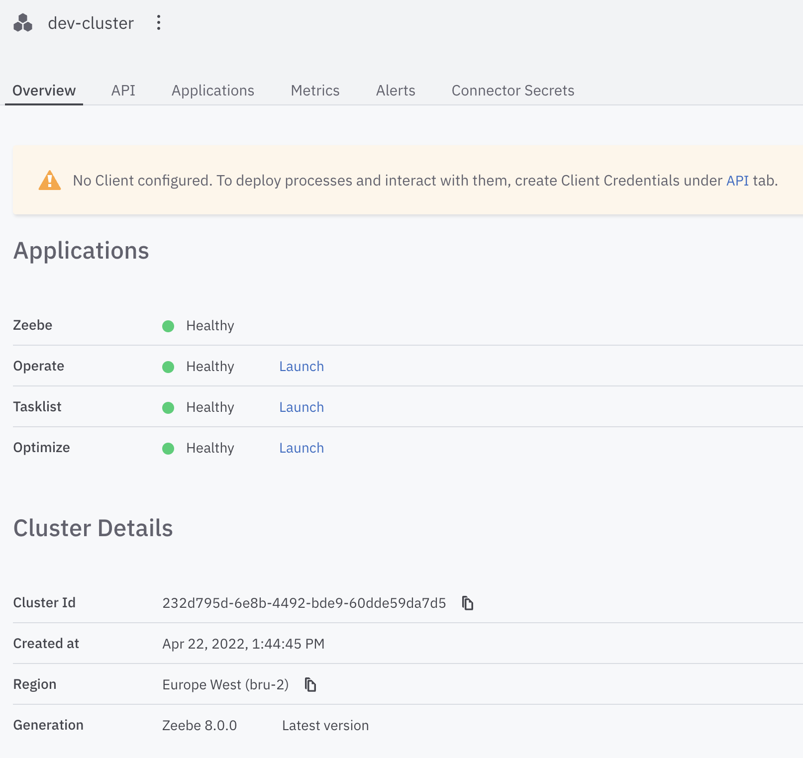

# Camunda-8 Code Studio

In a hypothetical near-future scenario, an outbreak of HZV - "Hypothetical Zombie Virus" - is turning infected people who are not treated in time into zombies, hungry for brains. 

In this workshop we are going to design a process to slow the spread of the infection, to prevent the human race from being overrun by Zombies. No big deal, we're just saving the future of humanity using BPMN.

Our focus will be centered around the quarantine. Of course, we will be doing this using the magic of Camunda Platform 8 and BPMN.  

Welcome to Camunda's Platform 8 Code studio, y'all! These exercises and notes have been designed for an actual workshop. 

They act as a resource for the moderator, but you can also follow the exercises here without attending an actual event - just imagine that you hear your favorite Developer Advocate talking to you. 

The readme contains detailed instruction on how to complete the exercises. In the other folders, you'll find the model solutions as well as the full code solutions.

The presentation from the workshop is provided as well.

**To structure this course we are going to split it into 6 exercises:**  
1. What kind of process can you imagine to make your government more efficient in processing HZV cases? - Design it! 
2. Having aligned on one process, we now need to automate things. But how? - Get familiar with Camunda 8 and discover features! 
3. Design / Implement a first draft of the process with User Tasks and Forms!
4. Automating it - Choosing a Camunda 8 Client and automating the process!
5. Analysis time - Is our process better than the government one? Generate awesome dashboards in Optimize!

# Table of Contents
* 🚀 [Getting Started](#getting-started)
* 🎓 [Exercises](#exercises)
  * [Exercise 1: Design the process](#exercise-1)
  * [Exercise 2: Get familiar with Camunda 8 and discover features](#exercise-2-get-familiar-with-camunda-8-and-discover-features)
  * [Exercise 3: Design a first draft of the process with User Tasks and Forms](#exercise-3-design-a-process-with-user-tasks-and-forms)
  * [Exercise 4: Automating the process by implementing a client](#exercise-4-automating-the-process-by-implementing-a-client)
  * [Exercise 5: Analysing the process using Optimize](#exercise-5-analysing-the-process-using-optimize)

# 🚀Getting Started
This section describes the prerequisites for this course. In order to participate, you need to set up a development environment 
of your choice. We are going to support you either in Node.js, Spring Boot, DotNet or Python. Please make sure you have 
the supported version and an IDE of your choice installed. 

| Environment   | Supported Version|
| ------------- | ---------------- |
| Node.js       | >= 16.6.1, >=14.17.5, or >=12.22.5|
| .NET        | .NET standard 2.0 or higher, .NET core 2.1 or higher or .NET framework 4.7.1 or higher|
| Spring Boot   | Java 8 or higher (Java 11 or higher recommended)    |
| Python        | Python 3.6 or higher   |

It is also recommended to sign up for the Camunda Platform 8 trial in front of the workshop. This trial will last for 30 days, 
so make sure it is still active when the workshop is taking place. You can sign up [here](https://accounts.cloud.camunda.io/signup).

# 🎓Exercises

## Exercise 1: Design the process

You can design your own process using using the [Camunda 8 Web Modeler](https://modeler.cloud.camunda.io/), or the [Camunda Modeler](https://camunda.com/download/modeler/). 

### Scenario

We are designing a process to manage the quarantine of persons infected with HZV - the "Hypothetical Zombie Virus". Statistically, 5% of people who are infected with the Zombie Virus turn into actual undead Zombies, with an insatiable craving to eat human brains. The other 95% experience mild symptoms - mostly an extreme craving for ice cream.

In order to stop the spread of the undead and the collapse of modern civilisation, you have been tasked with designing and automating a quarantine process using Camunda Platform 8.

The virus has a different effect in different age groups. People aged 30 and under recover faster, and they can be cleared of the danger of turning into Zombies in 5-7 days. People over 30 can turn into Zombies anywhere up to 10 days.

In order to keep society running, it's an acceptable risk to release people under 31 years of age from quarantine at the lower bound of their risk period (5 days), _if_ they work in a "critical infrastructure" role (like a power plant) - we're balancing the collapse of civilization from brain-eating Zombies or a collapse from a runaway nuclear power plant here.

When someone tests positive for the HZV the Health Department is informed. They immediately contact the infected person and notify them to quarantine, and for how long, then check on them regularly - every two days. If the person turns into a Zombie during the quarantine period, the quarantine process ends, and another process is started.

When the quarantine period ends without the person turning into a Zombie, the Health Department issues a digital recovery certificate and sends it to the person. This certificate can be used to get a 10% discount at participating ice-cream retailers.

We have an example process in [bpmn/hzvprocess.bpmn](bpmn/hzvprocess.bpmn), which is described in [README_process.md](README_process.md).

## Exercise 2: Get familiar with Camunda 8 and discover features 

After having modelled and aligned on our process diagram we are now going to discover the capabilities of Camunda 8.

Camunda Platform 8 is powered by Zeebe, a new class of BPMN workflow engine that delivers true horizontal scalability and enables high-performance use cases that were once beyond the realm of workflow automation. It is architected for the cloud from the ground up and is ideally for cloud application use cases such as microservices-based applications and integrates seamlessly with best-in-class cloud components.

The [Camunda 8 Console](https://console.cloud.camunda.io/) acts as entry point to Camunda Platform 8. After having logged in or signed up for a trial you will be redirected to the landing page. 

From this page onwards you can do various things: 
* It's the home of the **Organization** you are part of. So you can manage your team members accordingly. 
* Open up the **Web Modeler** to create some awesome collaborative BPMN models.
* Get to manage your **Clusters** i.e. to boot up a new one or to access an existing one. 
* And of course you have quick access to various **knowledge resources**.

Since you have already modeled a process in the previous task lets take a look at our Clusters for now. 
If you have not created one yet make sure to create a new one. Make sure to set a suitable name. 
 

After some time the cluster has been created and you should be able to see how the various applications are switching to healthy. 

As soon as this has happened you are ready to use them by clicking the *launch* button. For now we do not need to create a Client as the orange notification suggests. That will be part of the next exercise. 

Now it is your task to familiarize yourself with these tools. Let's quickly sum up what they are actually doing. Keep in mind
that we are going to revisit them in more depth during the next exercise. 
* **[Zeebe](https://docs.camunda.io/docs/components/zeebe/zeebe-overview/)**: A new class of BPMN workflow engine that delivers true horizontal scalability and enables high-performance use cases.
* **[Operate](https://docs.camunda.io/docs/components/operate/)**: A tool designed for teams to manage, monitor, troubleshoot running workflow instances.
* **[Tasklist](https://docs.camunda.io/docs/components/tasklist/introduction/)**: It is an out-of-the-box web application that’s tightly integrated with Camunda’s process orchestration capabilities. 
Simply model a business process and deploy it to the Workflow Engine; when a user needs to work on a task, they’ll see it appear in Tasklist.
* **[Optimize](https://docs.camunda.io/docs/components/optimize/what-is-optimize/)**: Create business-friendly reports and dashboards as well as alerts that help you identify process bottlenecks and improve your overall end-to-end process.

Enjoy experimenting around! 

## Exercise 3: Design a process with User Tasks and Forms
We have created a process in our Camunda Platform 8 environment during [exercise 1](#exercise-1) already. In this section we want to deploy this process after having added Camunda Forms to a User Task. 

In the animated image below you can see how to **change the type of activity**. After having done so we can change some User Task specific properties such as the assignee. In addition, you can find an empty property for a form in there. 

After accomplishing that we can now focus on **creating a Form** by using an intuitive form builder. You can select to create a new one in your Modeler project. The form builder allows you to drag and drop common elements used for forms onto a canvas. Of course, you can  set certain properties right in there. After finished configuring your form you can also take a log on the JSON based representation.

> Now feel free to create a meaningful form for your User-Task

After having accomplished that we need to figure out how to **attach to a Form to a User Task**. Please go back to your BPMN Model and select your task for this purpose. Now you have two possibilities:
* Either you can click on the "blue context menu" to choose and import an available Form
* Or you can copy the JSON shown before and add it manually to the "Form JSON configuration"

Now we are good to deploy our process model to the engine! Click the "Deploy Diagram" Button to see if there aren't any syntactic mistakes in your model. Afterwards you can start a process instance by clicking on the related button. You should now be able to observe
the progress in Operate and work on the User Task in Tasklist. 

In the end you will be able to see that the process has ended successfully. 

Congratulations 🎉! You have managed to start and execute your first process instance containing only a User Task! Now you have earned yourself a little break ☕️🥐.

## Exercise 4: Automating the process by implementing a client
Now, we are ready to automate the process we have created and aligned on. Below you can find a representation of that process:

To automate this process three steps need to be automated:
1. Notify the person to quarantine 
2. Generate certificate of recovery 
3. Send certificate of recovery

The automation can be done in any language you prefer. We provide solutions in Node.js, .Net, SpringBoot and Python. 
You can find a more detailed solution in the language specific readme. 
- [Node.js](./src/NodeJSWorker/README.md)
- [.Net](./src/DotNetCloudWorker/readme.md)
- [SpringBoot](./src/JavaCloudWorker/readme.md)
- [Python](./src/PythonCloudWorker/readme.md)

## Exercise 5: Analysing the Process using Optimize
Having automated the process and tried it out multiple times, we are ready to analyse the process in Optimize. This tool helps you to create business-friendly reports and dashboards as well as alerts that help you to identify process bottlenecks and improve the overall performance of your end-to-end process.

To get started, please launch the Optimize application from your Cluster and create a new collection for our reports and dashboards. Remember to select the HZV process as shown below. 

After doing this, we can see our process definition showing up as a data source. In this view we could also add more users to our collection or define alerts which will be triggered when a certain report falls below or reaches above a threshold. 
To start with, we can create a dashboard. To do so in just a few clicks we can make use of a template.

Now you can modify these reports, and play around with this tool to discover all its possibilities. 